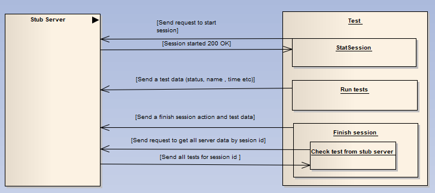

# Drill native autotest agent

This module contains the native agent for JVM autotest - [list of frameworks](https://drill4j.github.io/docs/supported-frameworks).

These autotest-agents add Drill headers to HTTP requests in order to track coverage. See more in [core concepts](https://drill4j.github.io/docs/core-concepts).

## Modules

- **autotest-agent**: Autotest agent classes
- **autotest-runtime**: Autotest agent SessionProvider classes
- **tests-common**: Common classes for tests-* modules
- **tests-admin-stub-server**: Stub server (emulating test2code-plugin) for agent communications during testing
- **tests-***: Modules contains the tests for autotest agent

## Test workflow
1. Before the tests are started, the stub server emulating test2code plugin the work is started
2. Before starting the tests, we manually start the session
3. During the tests, we send information about completed tests to the stub server
4. After the tests have passed, we send a request to the stop session
5. Then we send a request to get all the data that was sent to the server during the tests
6. Then we compare the expected data with the received data with stub server

