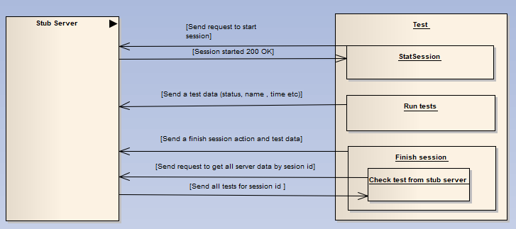

# Drill autotest agent test module
This module contains the tests for Autotest agent
# Test workflow
Before the tests are started, the stub server emulating test2code plugin the work is started.
<li>Before starting the tests, we manually start the session.</li>
<li>During the tests, we send information about completed tests to the stub server</li>
<li>After the tests have passed, we send a request to the stop session</li>
<li>Then we send a request to get all the data that was sent to the server during the tests</li>
<li>Then we compare the expected data with the received data with stub server</li>

## Modules which interacts with stub-server
<li>cucumber</li>
<li>https-headers</li>
<li>spock</li>
